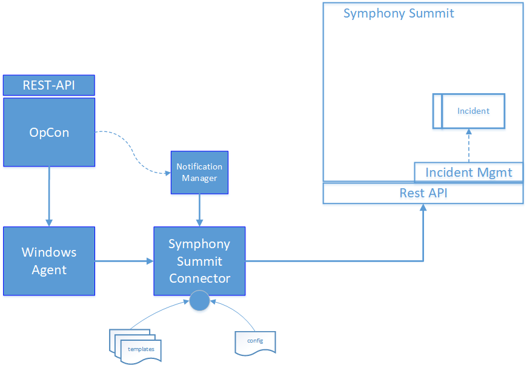
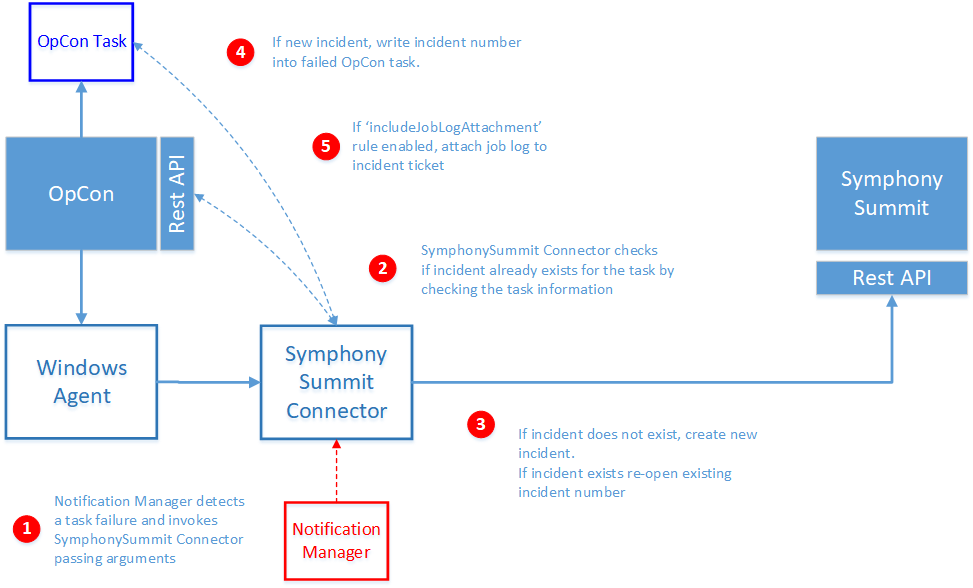

# Symphony Summit Connector

Latest version of the EasyVista Connector is **24.0.0**.

The Symphony Summit Connector integrates with the Symphony Summit Incident Management Module of IT Service Management allowing OpCon to submit creation requests through the REst-API when OpCon tasks fail.



The OpCon implementation includes components that detect when a task errors, that creates the Incident record (optionally includes adding the task job log) and inserts the returned incident number into the task in the Daily tables.

- Notification Manager 		An OpCon feature that initiates the Symphony Summit Connector passing arguments when a task encounters an error condition.
- Windows Agent		        An OpCon Windows Agent that is used to execute the Symphony Summit connector.
- Symphony Summit Connector An OpCon connector that communicates with Symphony Summit through the Symphony Summit Rest-API to create an incident.
- Config				    Defines connection to the OpCon System.
- Templates			        Contains the Symphony Summit definitions to be used for that connection.

## Process
The ticket creation process consists of the following steps.



1.	The Symphony Summit Connector is invoked by the Notification Manager when a failed task is detected. The Notification Manager uses the following standard OpCon properties to pass information to the Symphony Summit Connector.

```
$MACHINE NAME		The name of the Agent on which the task was executing.
$JOB TERMINATION	The termination code of the task.
$SCHEDULE DATE-SSUM	A special version of the Schedule Date format created to support Symphony Summit Connector.
$SCHEDULE ID		The schedule ID of the workflow in the OpCon System.
$SCHEDULE INST		The schedule instance of the workflow in the Daily OpCon table.
$SCHEDULE NAME		The name of the workflow.
$JOB NAME		    The name of the task.
```
2.	Before creating a new incident ticket, the SymphonySummit Connector checks to see if an incident ticket has already been created for the task by examining the Incident Ticket ID filed of the task information in the OpCon Daily Job table.
3.	If an incident ticket exists, the information is attached to the existing ticket and the ticket is re-opened. 
    If an incident does not exist, a new ticket is created.  
4.  The returned incident number is written into the OpCon task in the task Incident Ticket ID field. 
5. 	If the rule **includeJobLogAttachment** is enabled, the SymphonySummit Connector calls the OpCon Rest-API to retrieve the task’s job log and attaches this to the created or existing Incident ticket. 
