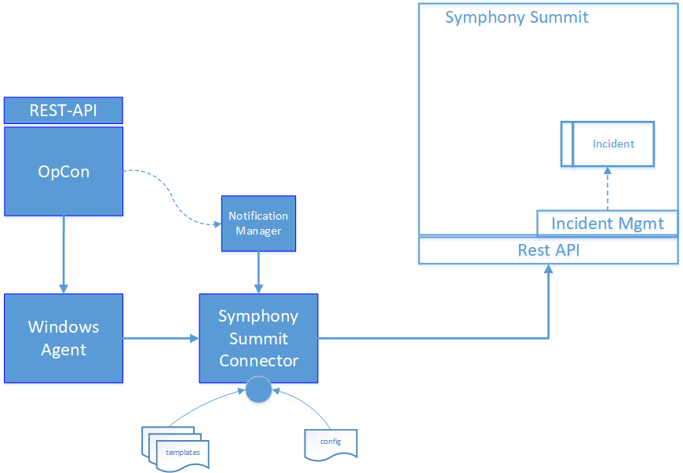
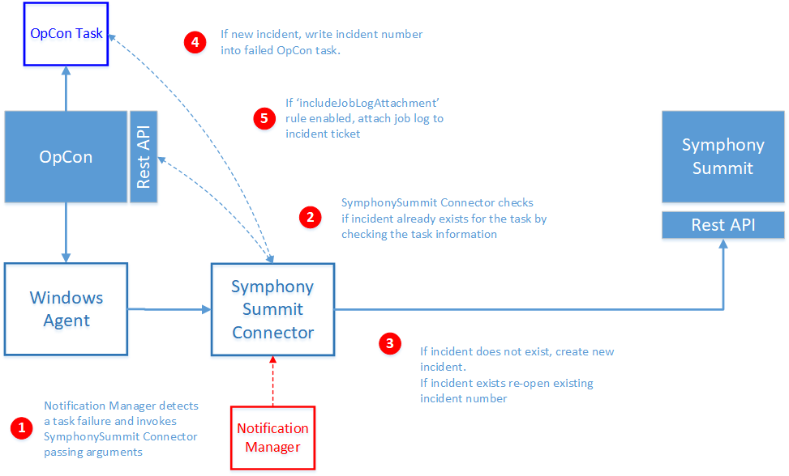

# Symphony Summit Connector overview

## What is it?

The Symphony Summit Connector integrates with the Symphony Summit Incident Management module of IT Service Management, allowing OpCon to submit incident creation requests through the REST API when OpCon jobs fail.

- Automates incident creation in Symphony Summit when OpCon jobs fail, removing manual ticket entry.
- Optionally attaches the OpCon job log to the incident for faster triage.
- Records the returned incident number on the OpCon job so operators can correlate jobs and tickets.
- Avoids duplicate tickets for the same job within a configurable daily window.
- Routes tickets using OpCon tags (workgroup name, category name, assigned engineer email).

Latest version of the Symphony Summit Connector is **24.2.0**.

## Components

The OpCon implementation includes components that detect when a job errors, create the incident record (optionally including the job log), and insert the returned incident number into the job in the Daily tables.



| Component | Description |
| --- | --- |
| Notification Manager | An OpCon feature that initiates the Symphony Summit Connector, passing arguments when a job encounters an error condition. |
| Windows Agent | An OpCon Windows Agent that runs the Symphony Summit Connector. |
| Symphony Summit Connector | An OpCon connector that communicates with Symphony Summit through the Symphony Summit REST API to create an incident. |
| Config | Defines the connection to the OpCon system. |
| Templates | Contain the Symphony Summit definitions used for the connection. |

## Process

The ticket creation process consists of the following steps.



1. The Symphony Summit Connector is invoked by Notification Manager when a failed job is detected. Notification Manager uses the following standard OpCon properties to pass information to the Symphony Summit Connector:

```
$MACHINE NAME       The name of the agent on which the job was running.
$JOB TERMINATION    The termination code of the job.
$SCHEDULE DATE-SSUM A special version of the Schedule Date format created to support the Symphony Summit Connector.
$SCHEDULE ID        The schedule ID of the workflow in the OpCon system.
$SCHEDULE INST      The schedule instance of the workflow in the Daily OpCon table.
$SCHEDULE NAME      The name of the workflow.
$JOB NAME           The name of the job.
```

2. Before creating a new incident ticket, the Symphony Summit Connector checks to see if an incident ticket has already been created for the job by examining the Incident Ticket ID field of the job information in the OpCon Daily Job table.
3. If an incident ticket exists, the information is attached to the existing ticket and the ticket is re-opened. If an incident does not exist, a new ticket is created.
4. The returned incident number is written into the OpCon job in the Incident Ticket ID field.
5. If the rule **includeJobLogAttachment** is enabled, the Symphony Summit Connector calls the OpCon REST API to retrieve the job log and attaches it to the created or existing incident ticket.

## FAQs

**Does the connector require a Windows Agent?**
Yes. The connector runs on a Windows Agent installed on the OpCon Windows Server. Notification Manager uses the agent's Run Command option to invoke the connector.

**Can a single connector submit incidents to multiple Symphony Summit instances?**
Yes. Each Symphony Summit instance is defined in its own template, and the template name is passed to the connector at run time using the `-t` argument.

**Can I prevent duplicate tickets for the same job on the same day?**
Yes. Enable the **submitSingleIncidentPerDay** rule. The connector records the last incident date in the job documentation field and uses the **DAILY_START_HOUR** configuration value to determine when a new ticket may be created.

**Does the connector support tag-based routing?**
Yes. When the **includeTagRouting**, **includeWorkGroupNameTag**, **includeCategoryNameTag**, or **includeAssignToTag** rules are enabled, OpCon job tags drive routing fields on the incident.

## Glossary

> **Notification Manager** — An OpCon feature that initiates external commands, including the Symphony Summit Connector, when a job reaches a defined trigger condition such as failure.

> **Symphony Summit** — An IT Service Management product whose Incident Management module receives tickets created by this connector.

> **Template** — A JSON file in the connector's `templates` directory that defines the connection to a Symphony Summit instance, the rules, the default attribute values, and tag-based routing definitions.

> **Tag routing** — A feature that uses OpCon job user-defined tags to set the `Assigned_WorkGroup_Name`, `Category_Name`, or `Assigned_Engineer_Email` attribute on the incident.

> **Daily Job table** — The OpCon database table that stores running and completed job records for the current operations day. The connector reads and updates the Incident Ticket ID field on this table.

## Related topics

- [Installation](./installation.md)
- [Operation](./operation.md)
- [Release notes](./release-notes.md)
